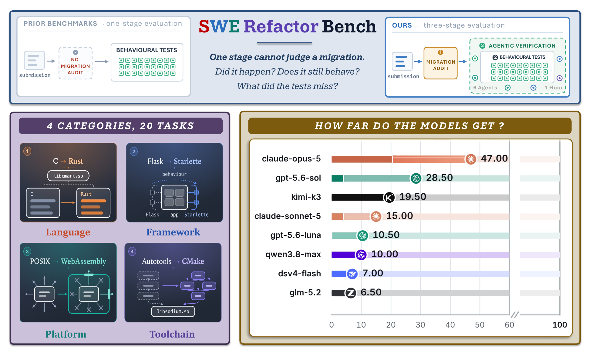
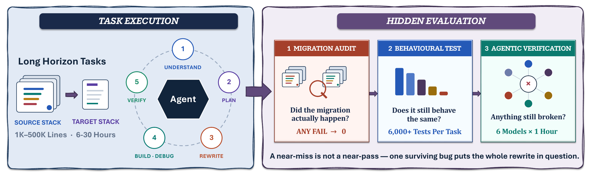
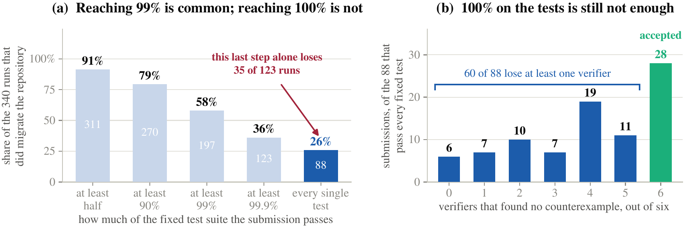

<div align="center">

# SWE Refactor Bench

**Can coding agents complete a long-horizon, whole-repository stack migration?**

[🏠 **Homepage & Leaderboard**](https://lab.einsia.ai/swe-refactor-bench)

</div>



## What it is

Twenty whole-repository migrations. Each starts from a real, frozen open-source release — **State A** —
and asks for the same product on a different stack — **State B** — with the public API, the release
artifacts and the observable behaviour unchanged, and the old stack gone from the tree. Tasks are sized
in hours to tens of hours and exercise the whole loop: read an unfamiliar codebase, plan the migration,
write it, build it, debug it, check it against the original.

What makes this hard to grade is that **a migration already passes its tests before the agent starts.**
Hand the repository back untouched and every behavioural suite gives it full marks. Behaviour alone
cannot be the question.

## How it is graded



```
S_task = 1[stage 1 passed] x ( 40 x 1[stage 2 complete]
                             + 60 x 1[stage 2 complete] x survived / 6 )
```

Reachable scores are **0, 40, 50, 60, 70, 80, 90, 100** — a task is either incomplete, or complete and
then measured on how well it holds up.

| Stage | The question | Worth |
| --- | --- | --- |
| **1 · Audit** | *Did the migration actually happen?* A model reads State A and the submission with nothing that executes them: is the new implementation on the default path, has the old one left the source, dependency and release closure. 136 required gates across the corpus, 5–10 per task, three samples voting on each. | a gate — fail one and the run scores **0** |
| **2 · Behavioural** | *Is it a drop-in replacement?* Modular rule-based tests build both sides and compare what they produce — artifacts, endpoints, the installed layout, the upstream test corpus — against ground truth frozen at image-build time. | **40**, all or nothing |
| **3 · Verification** | *Is anything still broken?* Six models get an hour each with both trees built and installed, and one instruction: construct an input on which the two disagree. A candidate counts only if it passes on the original, fails on the submission, and reproduces three times. | **60**, 10 per verifier that finds nothing |

## What the corpus is like



Across 520 graded runs from 8 frontier models: 340 actually migrated the repository, 88 passed every
fixed test, and **28 were accepted**. Thirteen of the twenty tasks were solved by no model at all.

## Tasks

Seven language rewrites, seven framework rewrites, three platform ports, three build-toolchain
migrations. Every task follows the schema in [`docs/SCHEMA.md`](docs/SCHEMA.md).

<details>
<summary><b>All twenty tasks</b></summary>

| Task | State A → State B |
| --- | --- |
| [`lang01-cmark-c-to-rust`](tasks/lang01-cmark-c-to-rust) | cmark 0.31.1, C → Rust with no external crates; byte-identical output, unchanged C ABI |
| [`lang02-zlib-c-to-java`](tasks/lang02-zlib-c-to-java) | zlib 1.3.1, 13.2k lines of C89 → one JPMS module on Java 17, no `java.util.zip`, no JNI; deflate bit-identical at every level |
| [`lang03-sqlparse-python-to-go`](tasks/lang03-sqlparse-python-to-go) | sqlparse 0.5.3, 4,024 lines of Python → a Go module closed over the standard library |
| [`lang04-acorn-js-to-rust`](tasks/lang04-acorn-js-to-rust) | acorn 8.14.0, three JavaScript packages → Rust 1.90, no crates; ESTree JSON and SyntaxError text unchanged |
| [`lang05-goyaml-go-to-zig`](tasks/lang05-goyaml-go-to-zig) | go-yaml v3.0.1, 7,609 logic lines of Go → Zig 0.14.1, standard library only |
| [`lang06-jsonnet-cpp-to-csharp`](tasks/lang06-jsonnet-cpp-to-csharp) | jsonnet 0.20.0, 14,958 lines of C++11 → C# on .NET 8 against the base class library alone |
| [`lang07-jsonata-js-to-typescript`](tasks/lang07-jsonata-js-to-typescript) | JSONata 2.2.2, 6,376 logic lines of JavaScript → TypeScript under `strict`, no dependency |
| [`fw01-httpbin-flask-to-asgi`](tasks/fw01-httpbin-flask-to-asgi) | httpbin 0.10.2, Flask/Werkzeug + gunicorn-gevent → Starlette + uvicorn, unchanged HTTP contract |
| [`fw02-jsonserver-express-to-fastify`](tasks/fw02-jsonserver-express-to-fastify) | json-server 0.17.4, Express 4 and seven middlewares → Fastify 5 |
| [`fw03-conduit-vue-to-react`](tasks/fw03-conduit-vue-to-react) | Conduit, Vue 2.6 + vue-router + vuex on webpack 4 → React 18.3 + react-router 6 on Vite 5 |
| [`fw04-chartmuseum-gin-to-chi`](tasks/fw04-chartmuseum-gin-to-chi) | ChartMuseum v0.15.0, gin 1.8.1 → go-chi v5 on net/http, no compatibility layer |
| [`fw05-miniserve-actix-to-axum`](tasks/fw05-miniserve-actix-to-axum) | miniserve 0.27.1, actix-web 4 → axum 0.7 on tower/hyper, actix ecosystem absent |
| [`fw06-uploadserver-gorillamux-to-nethttp`](tasks/fw06-uploadserver-gorillamux-to-nethttp) | uploadserver v2.2.0, gorilla/mux → `net/http.ServeMux` with Go 1.22 method patterns |
| [`fw07-graphhopper-dropwizard-to-springboot`](tasks/fw07-graphhopper-dropwizard-to-springboot) | GraphHopper 11.0, a Dropwizard 4 web tier — 25 Jersey registrations, a 16-binding HK2 graph → Spring Boot 3.5 |
| [`pf01-sqlite-wasi-port`](tasks/pf01-sqlite-wasi-port) | SQLite 3.31.1, a 7,904-line POSIX VFS → wasm32-wasi with `SQLITE_OS_OTHER=1`, both native platform layers deleted |
| [`pf02-stylus-web-platform-port`](tasks/pf02-stylus-web-platform-port) | Stylus 0.63.0, CommonJS + Node built-ins across 137 modules → pure-ESM core in a restricted V8 realm, byte-exact CSS |
| [`pf03-quickjs-byteorder-port`](tasks/pf03-quickjs-byteorder-port) | QuickJS, 85k lines of C assuming little-endian x86-64 → one tree building for x86-64, s390x and armhf |
| [`build01-libsodium-autotools-to-cmake`](tasks/build01-libsodium-autotools-to-cmake) | libsodium 1.0.20, GNU Autotools → CMake; same ABI, same release artifacts, same hardening |
| [`build02-gson-maven-to-gradle`](tasks/build02-gson-maven-to-gradle) | Gson 2.10.1, a Maven reactor with five plugins → one offline Gradle build, four artifacts comparable class byte for class byte |
| [`build03-pycryptodome-setuptools-to-meson`](tasks/build03-pycryptodome-setuptools-to-meson) | pycryptodome 3.20.0, `setup.py` on distutils → Meson + meson-python; same 41 ctypes libraries, same 277 exported symbols |

</details>

## Running it

The agent phase uses [Harbor](https://pypi.org/project/harbor/), a separate Apache-2.0 runner; every
graded stage can also be run by hand with `swerefactor`. This repository ships two adapters that reproduce
the pinned harness the corpus was measured with — offline, with session-resume and egress locked to the
model gateway.

```bash
pip install harbor        # Python 3.12+

# gpt family
PYTHONPATH=infra SRB_CODEX_BINARY=/path/to/codex-0.146.0 OPENAI_API_KEY=$KEY \
  harbor run -p tasks/<task-id> -a swerefactor.harbor_agent:SrbCodex \
    -m gpt-5.6-sol -ak version=0.146.0 -ak reasoning_effort=<effort>

# every other family
PYTHONPATH=infra SRB_CLAUDE_BINARY=/path/to/claude-2.1.220 ANTHROPIC_API_KEY=$KEY \
  harbor run -p tasks/<task-id> -a swerefactor.harbor_claude:SrbClaudeCode \
    -m claude-opus-5 -ak version=2.1.220 -ak reasoning_effort=<effort>
```

```bash
# validate a task: gates, weights, adversaries, stage images, lockfile drift
PYTHONPATH=infra python3 -m swerefactor validate --task-dir tasks/<task-id>

# the shared ladder's own unit tests
PYTHONPATH=infra python3 -m pytest infra/tests -q
```

Each stage gets its own image — stage 1 has no build system and often no compiler, stage 2 has the new
toolchain and asserts the old one is absent, stage 3 is the only image that can drive either build.
Building them, the per-task layout and the telemetry commands are in
[`docs/SCHEMA.md`](docs/SCHEMA.md) and [`CONTRIBUTING.md`](CONTRIBUTING.md).

## Licensing

This repository's own work — the shared grader in `infra/`, the twenty task definitions, the
documentation — is Apache-2.0 (`LICENSE`). Each task also redistributes one upstream release unmodified
as `environment/original.tar.gz`; those stay under their own terms, and [`NOTICE`](NOTICE) names every
one with its version, SPDX identifier, copyright holders and the path to its licence text inside the
archive. `NOTICE` is re-derived from the archives on every test run, so a task cannot be added or
re-pinned without appearing there. If you redistribute this repository, `NOTICE` travels with it.

## Citing this work

```bibtex
@misc{swerefactorbench2026,
  title        = {SWERefactorBench: whole-repository migration as a benchmark},
  author       = {The SWERefactorBench Authors},
  year         = {2026},
  howpublished = {\url{https://github.com/Einsia/SWE-Refactor-Bench}}
}
```
